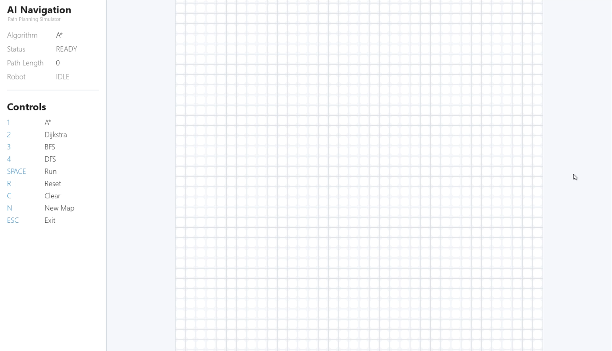
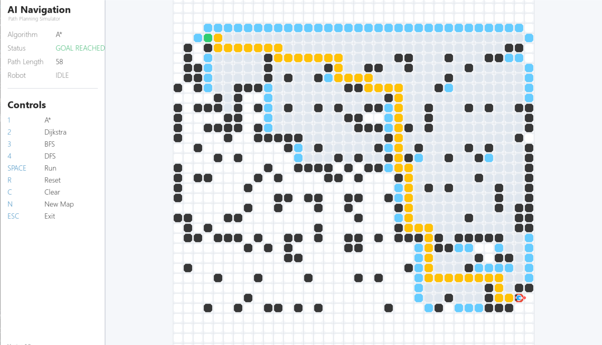
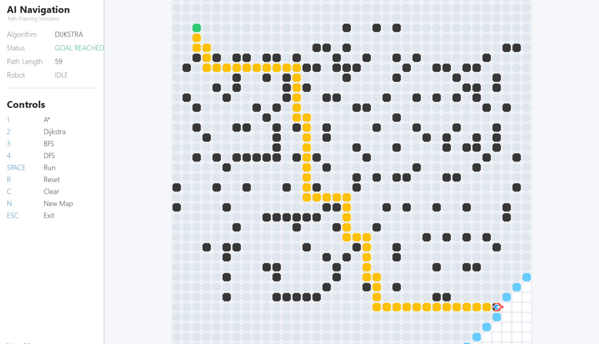
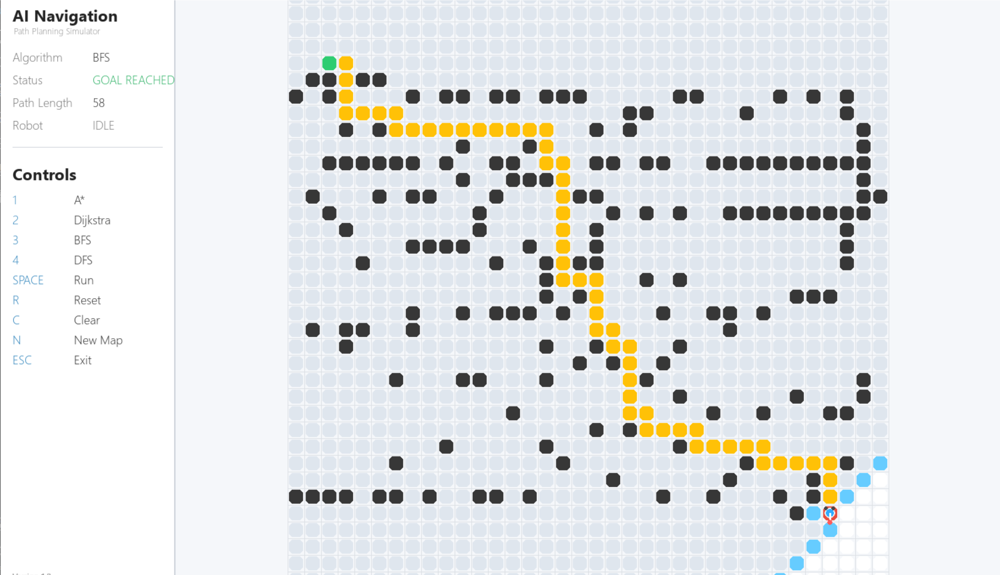
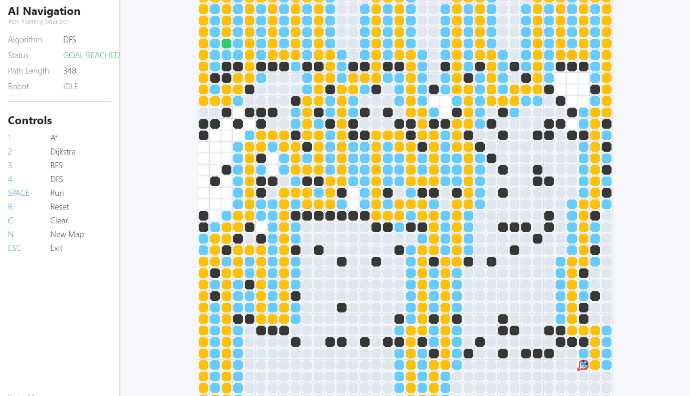

# 🤖 AI-Based Autonomous Navigation System

> An industry-oriented AI path planning simulator built with **Python** and **Pygame**, featuring multiple search algorithms, real-time visualization, and smooth autonomous robot navigation.


---

# 📌 Project Overview

The **AI-Based Autonomous Navigation System** is an interactive desktop simulator that demonstrates how autonomous robots navigate from a start position to a goal while avoiding obstacles using classical Artificial Intelligence (AI) path planning algorithms.

Built with **Python** and **Pygame**, the simulator provides real-time visualization of graph search algorithms, allowing users to observe how different algorithms explore the environment, discover paths, and guide an autonomous robot toward its destination.

This project was developed as an **industry-oriented portfolio project** to demonstrate:

- Artificial Intelligence fundamentals
- Autonomous robot navigation
- Graph search algorithms
- Object-Oriented Programming
- Modular software architecture
- Interactive desktop application development
- Clean Python project organization

The project focuses on both algorithm implementation and software engineering practices, making it suitable as a portfolio project for AI, Robotics, Python, and Software Development roles.

---

# ✨ Key Highlights

- 🤖 Interactive autonomous robot navigation
- 🧠 Four classical AI path planning algorithms
- 🖥️ Real-time algorithm visualization
- 🎮 Smooth robot movement animation
- 🚧 Dynamic obstacle creation
- 📊 Professional HUD interface
- 📂 Modular project architecture
- ⚡ Fast and responsive simulation
- 💻 Clean and maintainable Python code
- 🎯 Industry-oriented portfolio project

---

# 🚀 Features

### Environment

- Interactive grid-based environment
- Mouse-based start node selection
- Mouse-based goal node selection
- Dynamic obstacle placement
- Obstacle removal
- Random map generation
- Grid reset functionality

### Path Planning

- A* Search
- Dijkstra Algorithm
- Breadth First Search (BFS)
- Depth First Search (DFS)

### Visualization

- Real-time search exploration
- Path reconstruction visualization
- Visited node animation
- Smooth robot movement
- Goal reached visualization
- Professional HUD layout
- Live algorithm status
- Path length display

### Software Engineering

- Object-Oriented Design
- Modular folder structure
- Reusable components
- Easy-to-extend architecture
- Clean project organization

---

# 🧠 Implemented Algorithms

| Algorithm | Implemented | Path Visualization | Robot Navigation |
|-----------|:-----------:|:------------------:|:----------------:|
| A* Search | ✅ | ✅ | ✅ |
| Dijkstra Algorithm | ✅ | ✅ | ✅ |
| Breadth First Search (BFS) | ✅ | ✅ | ✅ |
| Depth First Search (DFS) | ✅ | ✅ | ✅ |

---

# 📁 Project Structure

```text
AI-Based-Autonomous-Navigation-System/
│
├── assets/
│   │
│   ├── demo.mp4/
│   │   └── AI-Based-Autonomous-Navigation-System-Demo.mp4
│   │
│   └── screenshots/
│       ├── home.png
│       ├── astar_pathfinding.png
│       ├── dijkstra_pathfinding.png
│       ├── bfs_pathfinding.png
│       └── dfs_pathfinding.png
│
├── src/
│   ├── core/
│   ├── navigation/
│   ├── planning/
│   ├── simulation/
│   ├── utils/
│   └── visualization/
│
├── main.py
├── requirements.txt
├── LICENSE
├── README.md
└── .gitignore
```

---

# 📸 Screenshots

## 🏠 Home Screen



---

## ⭐ A* Search



---

## 📍 Dijkstra Algorithm



---

## 🌐 Breadth First Search (BFS)



---

## 🔍 Depth First Search (DFS)



---

# 🎥 Project Demo

The complete high-quality demonstration of the project is available on Instagram.

📱 **Instagram Portfolio**

https://www.instagram.com/pranavrautaipreneur/

🎬 **Project Demo Reel**

https://www.instagram.com/reel/DbRILBaPMjF/

---

# ▶️ Installation

## 1️⃣ Clone the Repository

```bash
git clone https://github.com/pranavraut7-ai/AI-Based-Autonomous-Navigation-System.git
```

---

## 2️⃣ Navigate to the Project Directory

```bash
cd AI-Based-Autonomous-Navigation-System
```

---

## 3️⃣ Install Dependencies

```bash
pip install -r requirements.txt
```

---

## 4️⃣ Run the Project

```bash
python main.py
```

The simulator window will open, allowing you to create custom environments, choose different algorithms, and observe real-time autonomous robot navigation.

---

# 🎮 Controls

| Key / Mouse | Action |
|-------------|--------|
| Left Click | Place **Start → Goal → Obstacles** |
| Right Click | Remove selected cell |
| **1** | Select **A*** Search |
| **2** | Select **Dijkstra** Algorithm |
| **3** | Select **Breadth First Search (BFS)** |
| **4** | Select **Depth First Search (DFS)** |
| **Space** | Run selected algorithm |
| **R** | Reset current simulation |
| **C** | Clear all obstacles |
| **N** | Generate a new random map |
| **ESC** | Exit the simulator |

---

# ⚙️ Technology Stack

| Category | Technologies |
|----------|--------------|
| Programming Language | Python 3 |
| Graphics Library | Pygame |
| Algorithms | A*, Dijkstra, BFS, DFS |
| Programming Paradigm | Object-Oriented Programming (OOP) |
| Domain | Artificial Intelligence |
| Application | Autonomous Navigation |
| Version Control | Git & GitHub |

---

# 🏗️ Project Workflow

The simulator follows a complete autonomous navigation pipeline:

```text
User Creates Environment
            │
            ▼
 Place Start & Goal Nodes
            │
            ▼
 Add Obstacles
            │
            ▼
 Select Search Algorithm
            │
            ▼
 Run Path Planning
            │
            ▼
 Search Visualization
            │
            ▼
 Shortest Path Generation
            │
            ▼
 Smooth Robot Navigation
            │
            ▼
 Goal Reached
```

---

# 📚 Learning Outcomes

This project demonstrates practical knowledge of:

- Artificial Intelligence fundamentals
- Classical graph search algorithms
- Autonomous robot path planning
- Graph traversal techniques
- Object-Oriented Programming
- Interactive desktop application development
- Modular software engineering
- Python project organization
- Event-driven programming using Pygame
- GitHub portfolio project development

---

# 📈 Future Improvements

The project can be further enhanced with:

- Greedy Best-First Search
- Bidirectional Search
- Jump Point Search (JPS)
- Weighted terrain navigation
- Diagonal movement support
- Dynamic moving obstacles
- Multi-robot path planning
- Performance benchmarking dashboard
- CSV export of algorithm statistics
- ROS (Robot Operating System) integration
- SLAM-based environment mapping
- Reinforcement Learning navigation agents

---

# 🤝 Contributing

Contributions, suggestions, and improvements are always welcome.

If you have ideas for improving the simulator or implementing additional path planning algorithms, feel free to fork the repository and submit a pull request.

---

# 👨‍💻 Author

**Pranav Raut**

Electrical Engineering Graduate

Passionate about:

- Artificial Intelligence
- Robotics
- Autonomous Systems
- Python Development
- Software Engineering

GitHub:

https://github.com/pranavraut7-ai

---

# 📄 License

This project is licensed under the **MIT License**.

See the `LICENSE` file for more information.

---

# ⭐ Support

If you found this project helpful or interesting:

⭐ Star the repository

🍴 Fork the project

🛠️ Share suggestions and improvements

Your support helps motivate future AI and Robotics projects.

---

## 🚀 Project Status

> **Version:** 1.0

> **Status:** ✅ Completed

> **Type:** Industry-Oriented Portfolio Project

> **Domain:** Artificial Intelligence • Robotics • Autonomous Navigation

---

<p align="center">

⭐ Thank you for visiting this project! ⭐

</p>